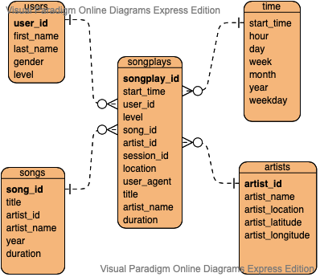

Welcome to the Sparkify Analytics Data Lake
===========================================

Sparkify the music streaming startup wants to convert move from a data warehouse to a data lake. This ETL pipeline was created to take the song and log data that resides in S3 buckets, transform the data into a star schema, and write the tables back out to S3 as parquet files.

## Technologies Used
* Python 3.6.3
* Spark
* Amazon Web Services (AWS) Elastic Map Reduce (EMR)
* AWS S3

## AWS EMR Cluster Setup
--------------------------
You will need to create an EMR cluster before running the ETL process.  

Once the cluster is 'waiting' will need to fill in the necessary fields in the *dl.cfg* file.
>|Config Varible|Value
>|--------------|-------
>|AWS_ACCESS_KEY_ID|AWS account ID
>|AWS_SECRET_ACCESS_KEY|AWS Secret Key
 
## Running the Scripts
Once the cluster is created and the access key and secret are in the config file you should be ready to run the ETL process.  

>python *etl.py*

The database schema is a star schema with the songplays table as the fact table and the other tables acting as dimensions of that table.

  

## Database Schema
-------

## Songplays Table (FACT TABLE)
* Location:  > s3a://sparkify_datalake/songplays.parquet
>| Column      | Data Type             | Conditions  |
>|-------------|-----------------------|-------------|
>| songplay_id | integer IDENTITY | PRIMARY KEY |
>| start_time  | timestamp          | NULLS       |
>| user_id     | integer               | NULLS       |
>| level       | varchar               | NULLS       |
>| song_id     | varchar               | NULLS       |
>| artist_id   | varchar               | NULLS       |
>| session_id  | integer               | NULLS       |
>| location    | varchar               | NULLS       |
>| user_agent  | varchar               | NULLS       |

## Users Table (DIMENSION TABLE)
* Location:  > s3a://sparkify_datalake/users.parquet
>| Column     | Data Type             | Conditions  |
>|------------|-----------------------|-------------|
>| user_id    | integer               | PRIMARY KEY |
>| first_name | varchar               | NULLS       |
>| last_name  | varchar               | NULLS       |
>| gender     | varchar               | NULLS       |
>| level      | varchar               | NULLS       |

## Songs Table (DIMENSION TABLE)
* Location:  > s3a://sparkify_datalake/songs.parquet
>| Column      | Data Type | Conditions  |
>|-------------|-----------|-------------|
>| song_id     | varchar   | PRIMARY KEY |
>| title       | varchar   | NULLS       |
>| artist_id   | varchar   | NULLS       |
>| year        | varchar   | NULLS       |
>| duration    | decimal   | NULLS       |

## Artists Table (DIMENSION TABLE)
* Location:  > s3a://sparkify_datalake/artists.parquet
>| Column           | Data Type | Conditions  |
>|------------------|-----------|-------------|
>| artist_id        | varchar   | PRIMARY KEY |
>| artist_name      | varchar   | NULLS       |
>| artist_location  | varchar   | NULLS       |
>| artist_latitude  | decimal   | NULLS       |
>| artist_longitude | decimal   | NULLS       |

## Time Table (DIMENSION TABLE)
* Location:  > s3a://sparkify_datalake/time.parquet
>| Column     | Data Type | Conditions |
>|------------|-----------|------------|
>| start_time | timestamp | PRIMARY KEY |
>| hour       | integer   | NULLS      |
>| day        | integer   | NULLS      |
>| week       | integer   | NULLS      |
>| month      | integer   | NULLS      |
>| year       | integer   | NULLS      |
>| weekday    | integer   | NULLS      |
 