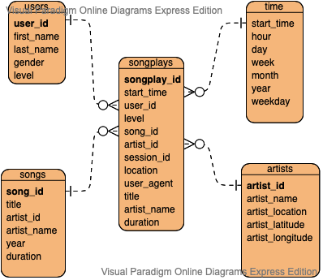

# Welcome to the Sparkify Analytics AWS Data Warehouse

The following ETL process was created to facilitate the analysis of data from Sparkify's music streaming app. The streaming music app produces transaction log data in JSON format. The data from the app is stored in Amazon S3 buckets in AWS.

## Technologies Used

- Python 3.6.3
- Amazon Web Services (AWS) Redshift
- AWS S3

## AWS Redshift Cluster Setup

---

Before you create your Redshift Cluster you need to create a user role with read only accesss to S3 and if you choose the programatic route of cluster creation you will need a user with programatic access. You will need to remember the IAM ARN for the new role that you have created. If you choose the jupyter notebook to reate your cluster you will also need the access key and secret for the user you created with programatic access.

You will need to fill in the necessary fields in the _dwh.cfg_ file.

> | Config Varible | Value                                      |
> | -------------- | ------------------------------------------ |
> | HOST           | cluster endpoint                           |
> | DB_NAME        | cluster name                               |
> | DB_USER        | Redshift user                              |
> | DB_PASSWORD    | Redshift user password                     |
> | DB_PORT        | DB Port 5439                               |
> | ARN            | IAM ARN of the role that you created above |
>
> ### Optional config variables for programatic creation with recomended values
>
> ---
>
> | Config Varible         | Value                                                       |
> | ---------------------- | ----------------------------------------------------------- |
> | DWH_CLUSTER_TYPE       | multi-node                                                  |
> | DWH_NUM_NODES          | 4                                                           |
> | DWH_NODE_TYPE          | dc2.large                                                   |
> | DWH_IAM_ROLE_NAME      | role that you created above                                 |
> | DWH_CLUSTER_IDENTIFIER | Cluster name                                                |
> | DWH_PORT               | Same as DB_PORT                                             |
> | DWH_USER               | Cluster user with appropriate access to create new clusters |
> | DWH_PASSWORD           | Password of the DWH_USER                                    |

You have two options to create the Redshift cluster in AWS:

1. Programatically with the IAC_dev jupyter notebook, IAC_dev.ipynb

- Fill in the appropriate config varibles in _dwh.cfg_
- Run the jupyter notebook one cell at a time
- Follow documentation in the notebook to ensure successful creation

2. Through the web interface in the AWS Management Console

- Sign into an AWS and navigate to the Redshift service
- Click on the Create Cluster button
- Select desired options or go with the defaults.

  > Make sure you remember the cluster name, master user name and password, and the Redshift role ARN created earlier.

Either method will be successfull in creating the intial Redshift cluster. Once the cluster is created it is ready create the tables and model the data.

## Running the Scripts

---

1.  First, run the create_tables.py to create the database and all tables. After this is run the database is ready to accept data.

    > python create_tables.py

2.  Process all song data and log data, using the etl.py script.

    > python _etl.py_

3.  Data is first moved into staging tables prior to be modeled into a STAR schema.

## ETL Process

---

The database tables are created and populated from the source data via two python scripts.

### Create Tables/Database

The _create_tables.py_ script uses the predefined queries in _sql_queries.py_ to create tables, establish data types, define any primary keys, and defines the insert statements that are required to build the database. The script starts by dropping any tables that may be present and running the create table SQL statements. The resulting collection of tables are clean and ready for data to be populated.

> _IMPORTANT!_ Everytime the create_tables script runs it will result in a blank set of tables.

### Populating the Database

The next step in the process runs queries intended to process the Sparkify app data, log and song data, from Amazon S3 buckets and insert the required elements into staging tables prior to beeing modeled into the STAR schema. The initial processing and cleaning of the data are accomplished in the _etl.py_ script. The transformed data is finally inserted into the database via the _INSERT INTO_ statements in the _sql_queries.py_ script.

### Validating the Data Load

The following SQL queries when executed in the AWS Redshift query editor should produce the results as show below.

> SELECT \* FROM songs WHERE song_id='SOZCTXZ12AB0182364'

> SELECT DISTINCT artist_name, title, duration
> FROM songplays s
> JOIN artists a ON s.artist_id = a.artist_id
> JOIN songs so ON s.song_id=so.song_id  
>  WHERE s.session_Id = 436;

> SELECT DISTINCT title, first_name, last_name
> FROM songplays s
> JOIN users u ON s.user_Id = u.user_Id
> JOIN songs so ON s.song_id=so.song_id
> WHERE s.session_Id = 182 AND s.user_id=10;

> SELECT DISTINCT first_name, last_name
> FROM songplays s
> JOIN users u ON s.user_Id = u.user_Id
> JOIN songs so ON s.song_id = so.song_id
> WHERE title = 'VooDoo'

## Database Schema

---

### Staging Tables

The ETL process is aided by two staging tables: stage_songs and stage_events.

## stage_events Table (STAGING TABLE)

> | Column        | Data Type | Conditions |
> | ------------- | --------- | ---------- |
> | artist        | varchar   | NULLS      |
> | auth          | varchar   | NULLS      |
> | firstName     | varchar   | NULLS      |
> | gender        | varchar   | NULLS      |
> | itemInSession | integer   | NULLS      |
> | lastName      | varchar   | NULLS      |
> | length        | float     | NULLS      |
> | level         | varchar   | NULLS      |
> | location      | varchar   | NULLS      |
> | method        | varchar   | NULLS      |
> | page          | varchar   | NULLS      |
> | registration  | numeric   | NULLS      |
> | sessionId     | numeric   | NULLS      |
> | song          | varchar   | NULLS      |
> | status        | numeric   | NULLS      |
> | ts            | timestamp | NULLS      |
> | userAgent     | varchar   | NULLS      |
> | userId        | numeric   | NULLS      |

## stage_songs Table (STAGING TABLE)

> | Column          | Data Type | Conditions  |
> | --------------- | --------- | ----------- |
> | num_songs       | integer   | PRIMARY KEY |
> | artist_id       | varchar   | NULLS       |
> | artist_latitude | varchar   | NULLS       |
> | artist_longitue | varchar   | NULLS       |
> | artist_location | varchar   | NULLS       |
> | artist_name     | varchar   | NULLS       |
> | song_id         | varchar   |
> | title           | varchar   | NULLS       |
> | duration        | float     | NULLS       |
> | year            | integer   | NULLS       |

The database schema is a star schema with the songplays table as the fact table and the other tables acting as dimensions of that table.

  

## Songplays Table (FACT TABLE)

> | Column      | Data Type        | Conditions  |
> | ----------- | ---------------- | ----------- |
> | songplay_id | integer IDENTITY | PRIMARY KEY |
> | start_time  | timestamp        | NULLS       |
> | user_id     | integer          | NULLS       |
> | level       | varchar          | NULLS       |
> | song_id     | varchar          | NULLS       |
> | artist_id   | varchar          | NULLS       |
> | session_id  | integer          | NULLS       |
> | location    | varchar          | NULLS       |
> | user_agent  | varchar          | NULLS       |

## Users Table (DIMENSION TABLE)

> | Column     | Data Type | Conditions  |
> | ---------- | --------- | ----------- |
> | user_id    | integer   | PRIMARY KEY |
> | first_name | varchar   | NULLS       |
> | last_name  | varchar   | NULLS       |
> | gender     | varchar   | NULLS       |
> | level      | varchar   | NULLS       |

## Songs Table (DIMENSION TABLE)

> | Column    | Data Type | Conditions  |
> | --------- | --------- | ----------- |
> | song_id   | varchar   | PRIMARY KEY |
> | title     | varchar   | NULLS       |
> | artist_id | varchar   | NULLS       |
> | year      | varchar   | NULLS       |
> | duration  | decimal   | NULLS       |

## Artists Table (DIMENSION TABLE)

> | Column           | Data Type | Conditions  |
> | ---------------- | --------- | ----------- |
> | artist_id        | varchar   | PRIMARY KEY |
> | artist_name      | varchar   | NULLS       |
> | artist_location  | varchar   | NULLS       |
> | artist_latitude  | decimal   | NULLS       |
> | artist_longitude | decimal   | NULLS       |

## Time Table (DIMENSION TABLE)

> | Column     | Data Type | Conditions  |
> | ---------- | --------- | ----------- |
> | start_time | timestamp | PRIMARY KEY |
> | hour       | integer   | NULLS       |
> | day        | integer   | NULLS       |
> | week       | integer   | NULLS       |
> | month      | integer   | NULLS       |
> | year       | integer   | NULLS       |
> | weekday    | integer   | NULLS       |
