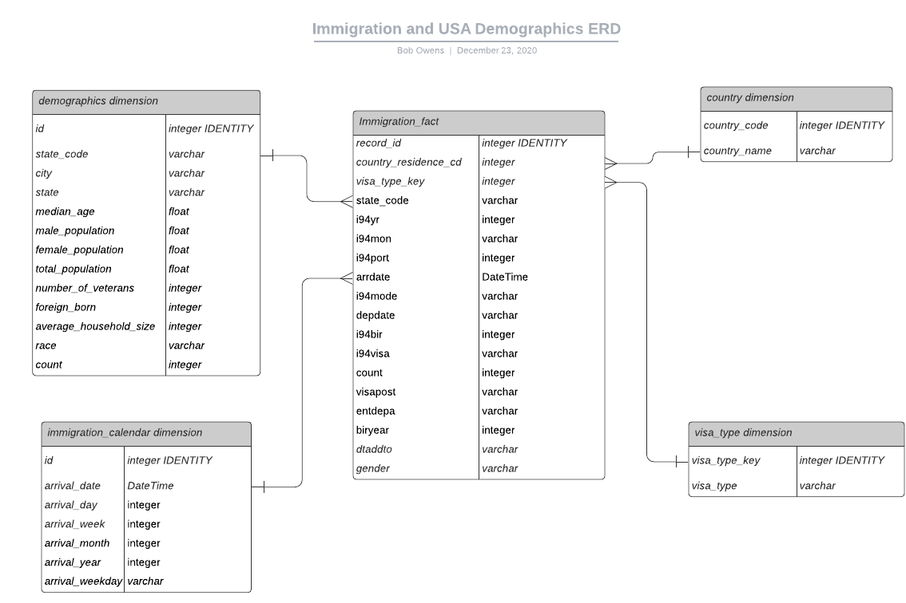

Data Engineering Capstone Project
===========================================

The purpose of this project is to cerate an ETL pipeline and analytics base for analysis of immigration and us demographic data.  This data infrastructure can be used to epxlore immigation patterns and how that relates to US census demographics.  This could for example be used to see where immigrants are relocating to in the US and how much of the population of that area is made up of immigrants.

## Technologies Used
* Python 3.6.3
* Apache Spark
* Amazon Web Services (AWS) Elastic Map Reduce (EMR)
* AWS S3

## AWS EMR Cluster Setup
--------------------------
You will need to create an EMR cluster before running the ETL process.  

Once the cluster is 'waiting' will need to fill in the necessary fields in the *config.cfg* file.
>|Config Varible|Value
>|--------------|-------
>|AWS_ACCESS_KEY_ID|AWS account ID
>|AWS_SECRET_ACCESS_KEY|AWS Secret Key
 
## Running the ETL Pipeline
Once the cluster is created and the access key and secret are in the config file you should be ready to run the ETL process.  

>spark-submit --packages saurfang:spark-sas7bdat:2.0.0-s_2.10 *etl.py*

## Conceptual Data Model
------------
The database schema is a star schema with the immigration_fact table as the fact table and the other tables acting as dimensions of that table.
## Fact Table
The immigration table is created from the SAS reports in the sas_data folder.  

## Dimension Tables
* The demogrpahics table is made up of data from the USA demographic data.
* The visa type dimension table is made up of data from the same SAS reports as the fact table.  
* The country table is made up of data from the immigration and US demographics data.
* The immigration table is made up of time data from the SAS reports and is derived when the immigration data is processed.

  

## Database Schema
-------

## Immigration Table (FACT TABLE)
* Location:  > s3://sparkprojectdata/immigration_fact.parquet
>| Column      | Data Type             | Conditions  |
>|-------------|-----------------------|-------------|
>| record_id | integer IDENTITY | PRIMARY KEY |
>| country_residence_cd  | integer          | NULLS       |
>| visa_type_key    | integer               | NULLS       |
>| state_code       | varchar               | NULLS       |
>| i94yr     | integer               | NULLS       |
>| i94mon   | varchar               | NULLS       |
>| i94port  | integer               | NULLS       |
>| arrdate    | DateTime               | NULLS       |
>| i94mode  | varchar               | NULLS       |
>| depdate  | varchar               | NULLS       |
>| i94bir  | integer               | NULLS       |
>| i94visa  | varchar               | NULLS       |
>| count  | integer               | NULLS       |
>| visapost  | varchar               | NULLS       |
>| entdepa  | varchar               | NULLS       |
>| biryear  | integer               | NULLS       |
>| dtaddto  | varchar               | NULLS       |
>| gender  | varchar               | NULLS       |

## Demographics Table (DIMENSION TABLE)
* Location:  > s3://sparkprojectdata/demographics.parquet
>| Column     | Data Type             | Conditions  |
>|------------|-----------------------|-------------|
>| id    | integer               | PRIMARY KEY |
>| state_code | varchar               | NULLS       |
>| city | varchar               | NULLS       |
>| state | varchar               | NULLS       |
>| median_age | float               | NULLS       |
>| male_population | float                | NULLS       |
>| female_population      | float                | NULLS       |
>| total_population | float                | NULLS       |
>| number_of_veterans   | integer                | NULLS       |
>| foreign_born    | integer                | NULLS       |
>| average_household_size   | integer                | NULLS       |
>| race     | varchar             | NULLS       |
>| count     | integer             | NULLS       |

## Visa Type Table (DIMENSION TABLE)
* Location:  > s3://sparkprojectdata/visatype.parquet
>| Column      | Data Type | Conditions  |
>|-------------|-----------|-------------|
>| visa_type_key     | integer   | PRIMARY KEY |
>| visa_type       | varchar   | NULLS       |

## Country Table (DIMENSION TABLE)
* Location:  > s3://sparkprojectdata/country.parquet
>| Column           | Data Type | Conditions  |
>|------------------|-----------|-------------|
>| country_code        | integer   | PRIMARY KEY |
>| country_name      | varchar   | NULLS       |

## Immigration Calendar Table (DIMENSION TABLE)
* Location:  > s3://sparkprojectdata/immigration_calendar.parquet
>| Column     | Data Type | Conditions |
>|------------|-----------|------------|
>| id | integer | PRIMARY KEY |
>| arrival_date       | DateTime   | NULLS      |
>| arrival_day        | integer   | NULLS      |
>| arrival_week       | integer   | NULLS      |
>| arrival_month      | integer   | NULLS      |
>| arrival_year       | integer   | NULLS      |
>| arrival_weekday    | varchar   | NULLS      |
 

 ## Mapping out the Data Pipeline

 ### The data pipline steps are shown below:
 * Load the datasets from various sources 
 * Clean immigration data to create a dataframe (Spark) for each month
 * Create and write to a parquet file the visa_type dimension table
 * Create and write to a parquet file  the calendar dimension table
 * Create and write to a parquet file the country dimension table
 * Create and write to a parquet file the immigration fact table
 * Load the demographics data
 * Clean the demographics data
 * Create and write to a parquet file the demographics dimension table
 

